# BlockDAG Freelance Platform

<div align="center">
  
  <br><br>
  
  **A Decentralized Marketplace for Secure Client-Freelancer Interactions on the Blockchain**
  
  
  
  
  
  
</div>

---

## 📋 Table of Contents

- [🎯 About The Project](#-about-the-project)
- [✨ Key Features](#-key-features)
- [🏗️ Architecture Overview](#️-architecture-overview)
- [📁 Project Structure](#-project-structure)
- [🔧 Technology Stack](#-technology-stack)
- [🚀 Getting Started](#-getting-started)
- [📱 Platform Walkthrough](#-platform-walkthrough)
- [🔗 Smart Contract Deep Dive](#-smart-contract-deep-dive)
- [🤝 Contributing](#-contributing)
- [📄 License](#-license)

---

## 🎯 About The Project

Traditional freelance platforms act as centralized middlemen, charging high fees, delaying payments, and enforcing opaque rules. Disputes lack transparency, and users depend entirely on the platform's control.

The **BlockDAG Freelance Platform** eliminates this dependency by shifting everything on-chain:

- **🔒 Trustless Agreements** – Smart contracts enforce project terms automatically
- **💰 Secure Escrow** – Funds are locked in escrow and only released upon approval
- **🆔 Transparent Identity** – Immutable on-chain record of profiles and reputations
- **🌐 Decentralized Control** – No company controlling funds or rules. The code is the law

This creates a fair marketplace where your wallet is your identity, your work is verified, and your payment is guaranteed.

---

## ✨ Key Features

| Feature | Description |
|---------|-------------|
| **Decentralized User Profiles** | Manage professional identity on-chain |
| **Role-Based Access Control** | Register as Client, Freelancer, or Both |
| **On-Chain Project Management** | Post jobs and manage them directly on blockchain |
| **Secure Escrow Payments** | Funds locked in smart contracts at project start |
| **Milestone-Based Workflow** | Break projects into smaller, payable tasks |
| **Public Reputation System** | Immutable on-chain rating system |
| **Multi-Token Support** | Accept payments in various ERC-20 tokens |
| **Transparent Dispute Resolution** | All interactions recorded on blockchain |

---

## 🏗️ Architecture Overview

The system is built on three interconnected layers:


### 🔄 Component Interaction Flow


---

## 📁 Project Structure


---

## 🔧 Technology Stack

### Frontend Technologies


### Smart Contract Technologies


---

## 🚀 Getting Started

### Prerequisites

Ensure you have the following installed:

- **Node.js** (v18+)
- **npm** or **yarn**
- **Git**
- **Foundry** (for contract development)

### Installation

```mermaid
flowchart TD
    A[🚀 Start] --> B[📦 Clone Repository]
    B --> C[⚡ Install Dependencies]
    C --> D{🛣️ Choose Path}
    
    D --> E[🎨 Frontend Development]
    D --> F[🔗 Contract Development]
    
    E --> E1[📝 Configure Environment]
    E1 --> E2[🏃 Start Dev Server]
    
    F --> F1[🔧 Choose Framework]
    F1 --> F2[⚡ Hardhat]
    F1 --> F3[🔨 Foundry]
    
    F2 --> F4[📋 Configure Hardhat]
    F3 --> F5[📋 Configure Foundry]
    
    F4 --> F6[🚀 Deploy Contracts]
    F5 --> F6
    F6 --> E1
    
    E2 --> G[✅ Ready to Develop!]
    
    style A fill:#22c55e,color:#ffffff
    style G fill:#22c55e,color:#ffffff
    style E fill:#3b82f6,color:#ffffff
    style F fill:#8b5cf6,color:#ffffff
```



#### Step 1: Clone the Repository
```bash
git clone https://github.com/yourusername/BlockDAG-Project.git
cd BlockDAG-Project
```

#### Step 2: Install Frontend Dependencies
```bash
cd frontend
npm install
# or
yarn install
```

#### Step 3: Environment Configuration
```bash
cp .env.example .env.local
```

Edit `.env.local` with your configuration:
```env
# Wallet Connect Project ID
NEXT_PUBLIC_WALLETCONNECT_PROJECT_ID=your_project_id

# RPC URLs
NEXT_PUBLIC_ETHEREUM_RPC_URL=https://mainnet.infura.io/v3/your_key
NEXT_PUBLIC_POLYGON_RPC_URL=https://polygon-mainnet.infura.io/v3/your_key

# Contract Addresses (after deployment)
NEXT_PUBLIC_USER_REGISTRY_ADDRESS=0x...
NEXT_PUBLIC_FREELANCE_ESCROW_ADDRESS=0x...
```

#### Step 4: Start Development Server
```bash
npm run dev
# or
yarn dev
```

#### Step 5: Deploy Smart Contracts (Optional)

**Using Foundry:**
```bash
cd contracts/foundry
forge build
anvil # Start local blockchain (new terminal)

# Deploy contracts (new terminal)
forge script script/DeployFreelanceEscrow.s.sol \
  --rpc-url http://127.0.0.1:8545 \
  --broadcast \
  --private-key 0xac0974bec39a17e36ba4a6b4d238ff944bacb478cbed5efcae784d7bf4f2ff80
```

**Using Hardhat:**
```bash
cd contracts/hardhat
npx hardhat compile
npx hardhat node # Start local blockchain (new terminal)

# Deploy contracts (new terminal)
npx hardhat run scripts/deploy.ts --network localhost
```

---

## 📱 Platform Walkthrough

### 👨‍💼 The Client Journey

```mermaid
flowchart LR
    A[🔗 Connect Wallet] --> B[📝 Register as Client]
    B --> C[📋 Create Project]
    C --> D[🎯 Add Milestones]
    D --> E[👀 Review Applications]
    E --> F[✅ Select Freelancer]
    F --> G[🔍 Review Submitted Work]
    G --> H{✅ Approve?}
    H -- ✅ Yes --> I[💰 Release Payment]
    H -- ❌ No --> J[🔄 Request Revisions]
    J --> G
    I --> K[⭐ Rate Freelancer]
    K --> L[🎉 Project Complete]
    
    style A fill:#3b82f6,color:#ffffff
    style I fill:#22c55e,color:#ffffff
    style L fill:#22c55e,color:#ffffff
```



### 👩‍💻 The Freelancer Journey

```mermaid
flowchart LR
    A[🔗 Connect Wallet] --> B[📝 Register as Freelancer]
    B --> C[🔍 Browse Projects]
    C --> D[📝 Apply to Projects]
    D --> E[🎉 Get Selected]
    E --> F[⚡ Work on Milestones]
    F --> G[📤 Submit Work]
    G --> H{✅ Approved?}
    H -- ✅ Yes --> I[💰 Receive Payment]
    H -- ❌ No --> J[🔧 Make Revisions]
    J --> G
    I --> K[⭐ Rate Client]
    K --> L[🎊 Milestone Complete]
    
    style A fill:#3b82f6,color:#ffffff
    style I fill:#22c55e,color:#ffffff
    style L fill:#22c55e,color:#ffffff
```



### 🔄 Project Lifecycle


---

## 🔗 Smart Contract Deep Dive

### 👤 UserRegistry Contract

```mermaid
classDiagram
    class UserRegistry {
        +struct User {
            uint userType
            string name
            uint rating
            uint projectsCompleted
            bool isRegistered
        }
        +mapping(address => User) users
        +event UserRegistered(address user, string name, uint userType)
        +event UserUpdated(address user, string name, uint userType)
        +event UserRatingUpdated(address user, uint rating)
        
        +registerUser(string name, uint userType) external
        +updateUserProfile(string name, uint userType) external
        +getUserProfile(address user) external view returns (User memory)
        +isRegistered(address user) external view returns (bool)
        +updateUserRating(address user, uint rating) external
        +incrementProjectsCompleted(address user) external
    }
```

**User Types:**
- `1` - Client only
- `2` - Freelancer only  
- `3` - Both client and freelancer

### 💼 FreelanceEscrow Contract

```mermaid
classDiagram
    class FreelanceEscrow {
        +struct Project {
            uint id
            address client
            address freelancer
            string title
            string description
            uint budget
            address token
            uint status
            uint[] milestoneIds
            uint createdAt
        }
        
        +struct Milestone {
            uint id
            uint projectId
            string description
            uint amount
            uint deadline
            uint status
            string feedback
            uint createdAt
        }
        
        +struct Application {
            address freelancer
            string proposal
            uint proposedBudget
            uint createdAt
        }
        
        +mapping(uint => Project) projects
        +mapping(uint => Milestone) milestones
        +mapping(uint => Application[]) projectApplications
        +uint nextProjectId
        +uint nextMilestoneId
        +UserRegistry userRegistry
        
        +createProject(string title, string description, uint budget, address token) external payable
        +applyToProject(uint projectId, string proposal, uint proposedBudget) external
        +getApplications(uint projectId) external view returns (Application[] memory)
        +assignFreelancer(uint projectId, address freelancer) external
        +createMilestone(uint projectId, string description, uint amount, uint deadline) external
        +getMilestones(uint projectId) external view returns (Milestone[] memory)
        +submitMilestone(uint milestoneId) external
        +approveMilestone(uint milestoneId) external
        +rejectMilestone(uint milestoneId, string feedback) external
        +completeProject(uint projectId) external
        +rateUser(address user, uint rating) external
    }
```

### 🔒 Security Features


---

## 🎨 Frontend Components Architecture


### 🔗 Web3 Integration Flow


---

## 🧪 Testing Strategy

### Smart Contract Tests


### Frontend Tests

```bash
# Run all tests
npm test

# Run with coverage
npm run test:coverage

# Run specific test suite
npm test -- --testPathPattern=components
```

---

## 🚀 Deployment Guide

### Contract Deployment


### Supported Networks

| Network | Chain ID | Status |
|---------|----------|--------|
| Ethereum Mainnet | 1 | ✅ Supported |
| Polygon | 137 | ✅ Supported |
| BSC | 56 | 🔄 Coming Soon |
| Arbitrum | 42161 | 🔄 Coming Soon |

---

## 📊 API Reference

### Smart Contract Events

```typescript
// UserRegistry Events
event UserRegistered(
    address indexed user,
    string name,
    uint userType
);

event UserUpdated(
    address indexed user,
    string name,
    uint userType
);

// FreelanceEscrow Events
event ProjectCreated(
    uint indexed projectId,
    address indexed client,
    string title,
    uint budget
);

event ProjectAssigned(
    uint indexed projectId,
    address indexed freelancer
);

event MilestoneCreated(
    uint indexed milestoneId,
    uint indexed projectId,
    string description,
    uint amount
);

event MilestoneApproved(
    uint indexed milestoneId,
    address indexed freelancer,
    uint amount
);
```

---

## 🤝 Contributing

We welcome contributions from the community! Here's how you can help:

```mermaid
flowchart LR
    A[🍴 Fork Repository] --> B[🌿 Create Feature Branch]
    B --> C[💻 Make Changes]
    C --> D[✅ Run Tests]
    D --> E[📝 Update Documentation]
    E --> F[🚀 Submit Pull Request]
    F --> G[👀 Code Review]
    G --> H[🎉 Merge]
    
    style A fill:#3b82f6,color:#ffffff
    style H fill:#22c55e,color:#ffffff
```



### Development Guidelines

1. **Code Style**: Follow the existing code style and use Prettier for formatting
2. **Testing**: Add tests for new features and ensure all tests pass
3. **Documentation**: Update documentation for any new features or changes
4. **Commit Messages**: Use conventional commit format

### Reporting Issues

- 🐛 **Bug Reports**: Use the bug report template
- 💡 **Feature Requests**: Use the feature request template
- 📚 **Documentation**: Help improve our docs

---

## 🔮 Roadmap


---

## 📄 License

This project is licensed under the MIT License - see the [LICENSE](LICENSE) file for details.

```
MIT License

Permission is hereby granted, free of charge, to any person obtaining a copy
of this software and associated documentation files (the "Software"), to deal
in the Software without restriction, including without limitation the rights
to use, copy, modify, merge, publish, distribute, sublicense, and/or sell
copies of the Software, and to permit persons to whom the Software is
furnished to do so, subject to the following conditions:

The above copyright notice and this permission notice shall be included in all
copies or substantial portions of the Software.
```

---

## 🙋‍♀️ Support & Community

### Get Help

- 📖 **Documentation**: [docs.blockdag-freelance.com](https://docs.blockdag-freelance.com)
- 💬 **Discord**: [Join our community](https://discord.gg/blockdag-freelance)
- 🐦 **Twitter**: [@BlockDAGFreelance](https://twitter.com/BlockDAGFreelance)
- 📧 **Email**: support@blockdag-freelance.com

### Community Guidelines

- Be respectful and inclusive
- Help others learn and grow
- Share knowledge and experiences
- Follow our code of conduct

---

<div align="center">
  <p>
    <strong>Built with ❤️ by the BlockDAG Community</strong>
  </p>
  <p>
    <a href="https://blockdag.network">Visit BlockDAG.network</a> •
    <a href="#-table-of-contents">Back to top</a>
  </p>
</div>
